<!-- generated-by: scripts/build-evidence-projection.mjs -->
<!-- source: config/evidence-graph.json — edit the graph, never this file -->

# Evidence Graph

Machine-readable dependency graph for public evidence artifacts. Sources may be exact paths or single/double-star globs.

**36 nodes** · **24** participate in the publish cascade ·
derived only from a graph that passes `validateEvidenceGraph()`.

This file is a projection. To change it, change `config/evidence-graph.json` and run
`node scripts/build-evidence-projection.mjs`. `--check` fails the build if the two drift.

## Why this graph exists

Every node is a derived public artifact whose bytes must stay reproducible from its
sources. A workflow that commits a source without regenerating its dependants leaves the
tree self-inconsistent — the artifact serves a stale value on a public trust surface until
a human notices. `check-publish-cascade-coverage.mjs` reads this graph to make that
structurally impossible; `check-evidence-graph.mjs` keeps the graph itself acyclic and
complete; and the pre-push coherence scan reads it to decide what a given diff must
re-verify. (That scan is named by role, not filename: `check-orphan-scripts.mjs` treats a
basename in prose as a consumer reference, and a doc mention is documentation, not wiring.)

## Dependency diagram

Double-bordered nodes participate in the publish cascade. External inputs are grouped by
directory family to keep the shape readable.

```mermaid
flowchart LR
  subgraph inputs["source inputs"]
    n__git_[".git/"]
    n__github_[".github/"]
    n__well_known_[".well-known/"]
    n_agents_json["agents.json"]
    n_api_["api/"]
    n_assets_["assets/"]
    n_cloudflare_["cloudflare/"]
    n_config_["config/"]
    n_context_["context/"]
    n_data_["data/"]
    n_journal_["journal/"]
    n_membership_["membership/"]
    n_news_["news/"]
    n_package_json["package.json"]
    n_scripts_["scripts/"]
    n_status_["status/"]
    n_studio_pulse_["studio-pulse/"]
  end
  n_config_cache_evidence_classification_json["config/cache-evidence-classification.json"]
  n_api_candidate_artifact_manifest_json[["api/candidate-artifact-manifest.json"]]
  n_api_changelog_narrative_json["api/changelog-narrative.json"]
  n_api_citation_json[["api/citation.json"]]
  n__cache_cta_readiness_json[[".cache/cta-readiness.json"]]
  n_api_deploy_currency_json[["api/deploy-currency.json"]]
  n_api_evidence_graph_json[["api/evidence-graph.json"]]
  n_docs_EVIDENCE_GRAPH_md[["docs/EVIDENCE_GRAPH.md"]]
  n_api_founder_presence_json["api/founder-presence.json"]
  n_api_heartbeat_json["api/heartbeat.json"]
  n_index_html[["index.html"]]
  n_api_intent_map_json[["api/intent-map.json"]]
  n_index_html["index.html"]
  n_api_news_desk_json[["api/news-desk.json"]]
  n_api_news_desk_engagement_json[["api/news-desk-engagement.json"]]
  n_api_news_desk_freshness_json[["api/news-desk-freshness.json"]]
  n_api_news_desk_reactions_json[["api/news-desk-reactions.json"]]
  n_api_news_desk_stats_json[["api/news-desk-stats.json"]]
  n_news_index_html[["news/index.html"]]
  n_api_news_visual_receipts_json[["api/news-visual-receipts.json"]]
  n_api_newsroom_run_json[["api/newsroom-run.json"]]
  n_api_ecosystem_velocity_json["api/ecosystem-velocity.json"]
  n_pathways_builders_index_html["pathways/builders/index.html"]
  n_api_proof_aware_projects_json["api/proof-aware-projects.json"]
  n_api_public_intelligence_json[["api/public-intelligence.json"]]
  n_api_public_status_json[["api/public-status.json"]]
  n_api_rank_climbers_json["api/rank-climbers.json"]
  n_api_release_proof_json[["api/release-proof.json"]]
  n_api_security_posture_json[["api/security-posture.json"]]
  n_api_staging_deploy_receipt_json["api/staging-deploy-receipt.json"]
  n_docs_STARTUP_BRIEF_md["docs/STARTUP_BRIEF.md"]
  n_data_stats_surface_json[["data/stats-surface.json"]]
  n_api_status_proof_json[["api/status-proof.json"]]
  n_api_tt_summary_json["api/tt-summary.json"]
  n_api_worker_route_history_json[["api/worker-route-history.json"]]
  n_changelog_index_html[["changelog/index.html"]]
  n__git_ --> n_api_ecosystem_velocity_json
  n__github_ --> n_api_newsroom_run_json
  n__github_ --> n_api_release_proof_json
  n__well_known_ --> n_api_candidate_artifact_manifest_json
  n__well_known_ --> n_api_security_posture_json
  n_agents_json --> n_api_candidate_artifact_manifest_json
  n_api_ --> n__cache_cta_readiness_json
  n_api_ --> n_api_candidate_artifact_manifest_json
  n_api_ --> n_api_changelog_narrative_json
  n_api_ --> n_api_deploy_currency_json
  n_api_ --> n_api_intent_map_json
  n_api_ --> n_api_newsroom_run_json
  n_api_ --> n_api_proof_aware_projects_json
  n_api_ --> n_api_public_status_json
  n_api_ --> n_api_release_proof_json
  n_api_ --> n_api_security_posture_json
  n_api_ --> n_api_staging_deploy_receipt_json
  n_api_ --> n_api_status_proof_json
  n_api_ --> n_api_worker_route_history_json
  n_api_ --> n_changelog_index_html
  n_api_ --> n_data_stats_surface_json
  n_api_candidate_artifact_manifest_json --> n_api_release_proof_json
  n_api_candidate_artifact_manifest_json --> n_api_staging_deploy_receipt_json
  n_api_deploy_currency_json --> n_api_intent_map_json
  n_api_deploy_currency_json --> n_api_release_proof_json
  n_api_deploy_currency_json --> n_api_status_proof_json
  n_api_deploy_currency_json --> n_docs_STARTUP_BRIEF_md
  n_api_heartbeat_json --> n_api_public_status_json
  n_api_news_desk_engagement_json --> n_news_index_html
  n_api_news_desk_freshness_json --> n_index_html
  n_api_news_desk_freshness_json --> n_news_index_html
  n_api_news_desk_json --> n_api_intent_map_json
  n_api_news_desk_json --> n_index_html
  n_api_news_desk_reactions_json --> n_news_index_html
  n_api_news_desk_stats_json --> n_data_stats_surface_json
  n_api_news_desk_stats_json --> n_news_index_html
  n_api_newsroom_run_json --> n_api_status_proof_json
  n_api_public_intelligence_json --> n_api_candidate_artifact_manifest_json
  n_api_public_intelligence_json --> n_api_citation_json
  n_api_public_intelligence_json --> n_api_intent_map_json
  n_api_public_intelligence_json --> n_api_public_status_json
  n_api_public_status_json --> n_api_intent_map_json
  n_api_public_status_json --> n_api_status_proof_json
  n_api_public_status_json --> n_data_stats_surface_json
  n_api_public_status_json --> n_index_html
  n_api_security_posture_json --> n_api_status_proof_json
  n_api_staging_deploy_receipt_json --> n_api_release_proof_json
  n_api_status_proof_json --> n_api_citation_json
  n_api_status_proof_json --> n_data_stats_surface_json
  n_api_worker_route_history_json --> n_api_public_status_json
  n_assets_ --> n_api_candidate_artifact_manifest_json
  n_assets_ --> n_api_security_posture_json
  n_assets_ --> n_pathways_builders_index_html
  n_cloudflare_ --> n_api_security_posture_json
  n_config_ --> n_api_evidence_graph_json
  n_config_ --> n_api_security_posture_json
  n_config_ --> n_docs_EVIDENCE_GRAPH_md
  n_context_ --> n_api_founder_presence_json
  n_context_ --> n_api_heartbeat_json
  n_context_ --> n_api_public_intelligence_json
  n_context_ --> n_api_release_proof_json
  n_context_ --> n_api_security_posture_json
  n_context_ --> n_docs_STARTUP_BRIEF_md
  n_data_ --> n_api_news_desk_engagement_json
  n_data_ --> n_api_news_desk_freshness_json
  n_data_ --> n_api_news_desk_json
  n_data_ --> n_api_news_desk_reactions_json
  n_data_ --> n_api_news_desk_stats_json
  n_data_ --> n_api_news_visual_receipts_json
  n_data_ --> n_api_proof_aware_projects_json
  n_data_ --> n_api_release_proof_json
  n_data_ --> n_api_staging_deploy_receipt_json
  n_data_ --> n_api_tt_summary_json
  n_data_ --> n_api_worker_route_history_json
  n_data_ --> n_data_stats_surface_json
  n_data_ --> n_news_index_html
  n_data_ --> n_pathways_builders_index_html
  n_index_html --> n_api_candidate_artifact_manifest_json
  n_index_html --> n_api_deploy_currency_json
  n_journal_ --> n_pathways_builders_index_html
  n_membership_ --> n_api_candidate_artifact_manifest_json
  n_news_ --> n_api_news_visual_receipts_json
  n_package_json --> n_api_security_posture_json
  n_scripts_ --> n_api_rank_climbers_json
  n_scripts_ --> n_api_staging_deploy_receipt_json
  n_scripts_ --> n_config_cache_evidence_classification_json
  n_status_ --> n_api_candidate_artifact_manifest_json
  n_studio_pulse_ --> n_api_candidate_artifact_manifest_json
```

## Nodes

| Node | Output | Cascade | Depends on | Feeds |
|---|---|:--:|---|---|
| `cache-evidence-classification` | `config/cache-evidence-classification.json` | — | — | — |
| `candidate-artifact-manifest` | `api/candidate-artifact-manifest.json` | yes | `api/public-intelligence.json` `index.html` | `api/release-proof.json` `api/staging-deploy-receipt.json` |
| `changelog-narrative` | `api/changelog-narrative.json` | — | — | — |
| `citation` | `api/citation.json` | yes | `api/public-intelligence.json` `api/status-proof.json` | — |
| `cta-readiness` | `.cache/cta-readiness.json` | yes | — | — |
| `deploy-currency` | `api/deploy-currency.json` | yes | `index.html` | `api/intent-map.json` `api/release-proof.json` `api/status-proof.json` `docs/STARTUP_BRIEF.md` |
| `evidence-graph-agent` | `api/evidence-graph.json` | yes | — | — |
| `evidence-graph-doc` | `docs/EVIDENCE_GRAPH.md` | yes | — | — |
| `founder-presence` | `api/founder-presence.json` | — | — | — |
| `heartbeat` | `api/heartbeat.json` | — | — | `api/public-status.json` |
| `home-desk-module` | `index.html` | yes | `api/news-desk-freshness.json` `api/news-desk.json` | `api/candidate-artifact-manifest.json` `api/deploy-currency.json` |
| `intent-map` | `api/intent-map.json` | yes | `api/deploy-currency.json` `api/news-desk.json` `api/public-intelligence.json` `api/public-status.json` | — |
| `launch-age` | `index.html` | — | `api/public-status.json` | `api/candidate-artifact-manifest.json` `api/deploy-currency.json` |
| `news-desk` | `api/news-desk.json` | yes | — | `api/intent-map.json` `index.html` |
| `news-desk-engagement` | `api/news-desk-engagement.json` | yes | — | `news/index.html` |
| `news-desk-freshness` | `api/news-desk-freshness.json` | yes | — | `index.html` `news/index.html` |
| `news-desk-reactions` | `api/news-desk-reactions.json` | yes | — | `news/index.html` |
| `news-desk-stats` | `api/news-desk-stats.json` | yes | — | `data/stats-surface.json` `news/index.html` |
| `news-pages` | `news/index.html` | yes | `api/news-desk-engagement.json` `api/news-desk-freshness.json` `api/news-desk-reactions.json` `api/news-desk-stats.json` | — |
| `news-visual-receipts` | `api/news-visual-receipts.json` | yes | — | — |
| `newsroom-run` | `api/newsroom-run.json` | yes | — | `api/status-proof.json` |
| `oracle-velocity-public` | `api/ecosystem-velocity.json` | — | — | — |
| `pathways-pages` | `pathways/builders/index.html` | — | — | — |
| `proof-aware-projects` | `api/proof-aware-projects.json` | — | — | — |
| `public-intelligence` | `api/public-intelligence.json` | yes | — | `api/candidate-artifact-manifest.json` `api/citation.json` `api/intent-map.json` `api/public-status.json` |
| `public-status` | `api/public-status.json` | yes | `api/heartbeat.json` `api/public-intelligence.json` `api/worker-route-history.json` | `api/intent-map.json` `api/status-proof.json` `data/stats-surface.json` `index.html` |
| `rank-climbers` | `api/rank-climbers.json` | — | — | — |
| `release-proof` | `api/release-proof.json` | yes | `api/candidate-artifact-manifest.json` `api/deploy-currency.json` `api/staging-deploy-receipt.json` | — |
| `security-posture` | `api/security-posture.json` | yes | — | `api/status-proof.json` |
| `staging-deploy-receipt` | `api/staging-deploy-receipt.json` | — | `api/candidate-artifact-manifest.json` | `api/release-proof.json` |
| `startup-brief` | `docs/STARTUP_BRIEF.md` | — | `api/deploy-currency.json` | — |
| `stats-surface` | `data/stats-surface.json` | yes | `api/news-desk-stats.json` `api/public-status.json` `api/status-proof.json` | — |
| `status-proof` | `api/status-proof.json` | yes | `api/deploy-currency.json` `api/newsroom-run.json` `api/public-status.json` `api/security-posture.json` | `api/citation.json` `data/stats-surface.json` |
| `tt-summary` | `api/tt-summary.json` | — | — | — |
| `worker-route-history` | `api/worker-route-history.json` | yes | — | `api/public-status.json` |
| `you-asked-shipped` | `changelog/index.html` | yes | — | — |

## Builders and verification

| Node | Builder | Verify |
|---|---|---|
| `cache-evidence-classification` | `scripts/check-cache-evidence-classification.mjs` | `node scripts/check-cache-evidence-classification.mjs` |
| `candidate-artifact-manifest` | `scripts/build-candidate-artifact-manifest.mjs` | `node scripts/build-candidate-artifact-manifest.mjs --check` |
| `changelog-narrative` | `scripts/build-changelog-narrative.mjs` | `node scripts/build-changelog-narrative.mjs --check` |
| `citation` | `scripts/build-citation.mjs` | `node scripts/build-citation.mjs --check` |
| `cta-readiness` | `scripts/check-cta-readiness.mjs` | `node scripts/check-cta-readiness.mjs --check` |
| `deploy-currency` | `scripts/build-deploy-currency.mjs` | `node scripts/build-deploy-currency.mjs --check` |
| `evidence-graph-agent` | `scripts/build-evidence-projection.mjs` | `node scripts/build-evidence-projection.mjs --check` |
| `evidence-graph-doc` | `scripts/build-evidence-projection.mjs` | `node scripts/build-evidence-projection.mjs --check` |
| `founder-presence` | `scripts/generate-founder-presence.mjs` | `node scripts/generate-founder-presence.mjs --check` |
| `heartbeat` | `scripts/generate-heartbeat.mjs` | `node scripts/generate-heartbeat.mjs --check` |
| `home-desk-module` | `scripts/build-home-desk-module.mjs` | `node scripts/build-home-desk-module.mjs --check` |
| `intent-map` | `scripts/build-intent-map.mjs` | `node scripts/build-intent-map.mjs --check` |
| `launch-age` | `scripts/build-launch-age.mjs` | `node scripts/build-launch-age.mjs --check` |
| `news-desk` | `scripts/build-news-desk.mjs` | `node scripts/build-news-desk.mjs --check` |
| `news-desk-engagement` | `scripts/build-news-desk-engagement.mjs` | `node scripts/build-news-desk-engagement.mjs --check` |
| `news-desk-freshness` | `scripts/build-news-freshness.mjs` | `node scripts/build-news-freshness.mjs --check` |
| `news-desk-reactions` | `scripts/build-news-desk-reactions.mjs` | `node scripts/build-news-desk-reactions.mjs --check` |
| `news-desk-stats` | `scripts/build-news-desk-stats.mjs` | `node scripts/build-news-desk-stats.mjs --check` |
| `news-pages` | `scripts/generate-news-pages.mjs` | `node scripts/generate-news-pages.mjs --check` |
| `news-visual-receipts` | `scripts/build-news-visual-receipts.mjs` | `node scripts/build-news-visual-receipts.mjs --check` |
| `newsroom-run` | `scripts/build-newsroom-run.mjs` | `node scripts/build-newsroom-run.mjs --check` |
| `oracle-velocity-public` | `scripts/build-oracle-velocity-public.mjs` | `node scripts/build-oracle-velocity-public.mjs --check` |
| `pathways-pages` | `scripts/generate-pathways.mjs` | `node scripts/generate-pathways.mjs --check` |
| `proof-aware-projects` | `scripts/build-proof-aware-projects.mjs` | `node scripts/build-proof-aware-projects.mjs --check` |
| `public-intelligence` | `scripts/generate-public-intelligence.mjs` | `node scripts/generate-public-intelligence.mjs --check` |
| `public-status` | `scripts/build-public-status.mjs` | `node scripts/build-public-status.mjs --check` |
| `rank-climbers` | `scripts/build-rank-climbers.mjs` | `node scripts/build-rank-climbers.mjs --check` |
| `release-proof` | `scripts/build-release-proof.mjs` | `node scripts/build-release-proof.mjs --check` |
| `security-posture` | `scripts/build-security-posture.mjs` | `node scripts/build-security-posture.mjs --check` |
| `staging-deploy-receipt` | `scripts/deploy-staging.mjs` | `node scripts/check-staging-deploy-receipt.mjs` |
| `startup-brief` | `scripts/render-startup-brief.mjs` | `node scripts/check-startup-session-coherence.mjs` |
| `stats-surface` | `scripts/build-stats-surface.mjs` | `node scripts/build-stats-surface.mjs --check` |
| `status-proof` | `scripts/build-status-proof.mjs` | `node scripts/build-status-proof.mjs --check --check-content` |
| `tt-summary` | `scripts/build-tt-summary.mjs` | `node scripts/build-tt-summary.mjs --check` |
| `worker-route-history` | `scripts/build-worker-route-history.mjs` | `node scripts/build-worker-route-history.mjs --check` |
| `you-asked-shipped` | `scripts/build-you-asked-shipped.mjs` | `node scripts/build-you-asked-shipped.mjs --check` |

## External inputs

- `.git/` → `oracle-velocity-public`
- `.github/` → `newsroom-run`, `release-proof`
- `.well-known/` → `candidate-artifact-manifest`, `security-posture`
- `agents.json` → `candidate-artifact-manifest`
- `api/` → `candidate-artifact-manifest`, `changelog-narrative`, `cta-readiness`, `deploy-currency`, `intent-map`, `newsroom-run`, `proof-aware-projects`, `public-status`, `release-proof`, `security-posture`, `staging-deploy-receipt`, `stats-surface`, `status-proof`, `worker-route-history`, `you-asked-shipped`
- `assets/` → `candidate-artifact-manifest`, `pathways-pages`, `security-posture`
- `cloudflare/` → `security-posture`
- `config/` → `evidence-graph-agent`, `evidence-graph-doc`, `security-posture`
- `context/` → `founder-presence`, `heartbeat`, `public-intelligence`, `release-proof`, `security-posture`, `startup-brief`
- `data/` → `news-desk`, `news-desk-engagement`, `news-desk-freshness`, `news-desk-reactions`, `news-desk-stats`, `news-pages`, `news-visual-receipts`, `pathways-pages`, `proof-aware-projects`, `release-proof`, `staging-deploy-receipt`, `stats-surface`, `tt-summary`, `worker-route-history`
- `journal/` → `pathways-pages`
- `membership/` → `candidate-artifact-manifest`
- `news/` → `news-visual-receipts`
- `package.json` → `security-posture`
- `scripts/` → `cache-evidence-classification`, `rank-climbers`, `staging-deploy-receipt`
- `status/` → `candidate-artifact-manifest`
- `studio-pulse/` → `candidate-artifact-manifest`

## Build order

1. `cache-evidence-classification`
2. `changelog-narrative`
3. `cta-readiness`
4. `evidence-graph-agent`
5. `evidence-graph-doc`
6. `founder-presence`
7. `heartbeat`
8. `news-desk`
9. `news-desk-engagement`
10. `news-desk-freshness`
11. `news-desk-reactions`
12. `news-desk-stats`
13. `news-visual-receipts`
14. `newsroom-run`
15. `oracle-velocity-public`
16. `pathways-pages`
17. `proof-aware-projects`
18. `public-intelligence`
19. `rank-climbers`
20. `security-posture`
21. `tt-summary`
22. `worker-route-history`
23. `you-asked-shipped`
24. `home-desk-module`
25. `news-pages`
26. `public-status`
27. `launch-age`
28. `candidate-artifact-manifest`
29. `deploy-currency`
30. `intent-map`
31. `staging-deploy-receipt`
32. `startup-brief`
33. `status-proof`
34. `citation`
35. `release-proof`
36. `stats-surface`
