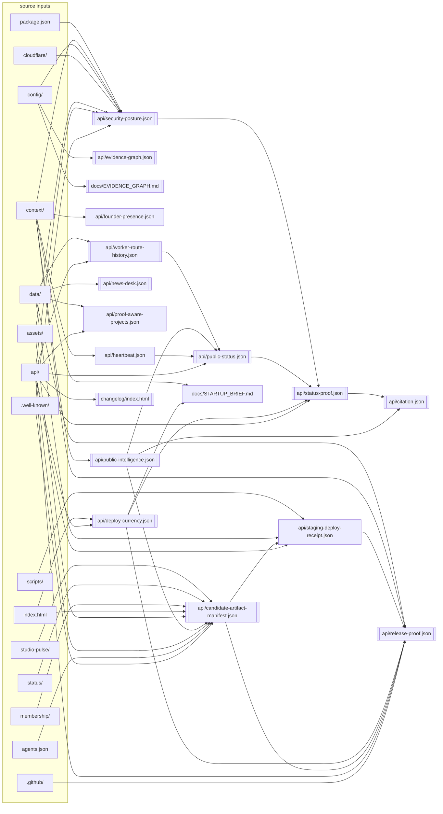

<!-- generated-by: scripts/build-evidence-projection.mjs -->
<!-- source: config/evidence-graph.json — edit the graph, never this file -->

# Evidence Graph

Machine-readable dependency graph for public evidence artifacts. Sources may be exact paths or single/double-star globs.

**18 nodes** · **13** participate in the publish cascade ·
derived only from a graph that passes `validateEvidenceGraph()`.

This file is a projection. To change it, change `config/evidence-graph.json` and run
`node scripts/build-evidence-projection.mjs`. `--check` fails the build if the two drift.

## Why this graph exists

Every node is a derived public artifact whose bytes must stay reproducible from its
sources. A workflow that commits a source without regenerating its dependants leaves the
tree self-inconsistent — the artifact serves a stale value on a public trust surface until
a human notices. `check-publish-cascade-coverage.mjs` reads this graph to make that
structurally impossible; `check-evidence-graph.mjs` keeps the graph itself acyclic and
complete; and the pre-push coherence scan reads it to decide what a given diff must
re-verify. (That scan is named by role, not filename: `check-orphan-scripts.mjs` treats a
basename in prose as a consumer reference, and a doc mention is documentation, not wiring.)

## Dependency diagram

Double-bordered nodes participate in the publish cascade. External inputs are grouped by
directory family to keep the shape readable.

## Nodes

| Node | Output | Cascade | Depends on | Feeds |
|---|---|:--:|---|---|
| `candidate-artifact-manifest` | `api/candidate-artifact-manifest.json` | yes | `api/public-intelligence.json` | `api/release-proof.json` `api/staging-deploy-receipt.json` |
| `citation` | `api/citation.json` | yes | `api/public-intelligence.json` `api/status-proof.json` | — |
| `deploy-currency` | `api/deploy-currency.json` | yes | — | `api/release-proof.json` `api/status-proof.json` `docs/STARTUP_BRIEF.md` |
| `evidence-graph-agent` | `api/evidence-graph.json` | yes | — | — |
| `evidence-graph-doc` | `docs/EVIDENCE_GRAPH.md` | yes | — | — |
| `founder-presence` | `api/founder-presence.json` | — | — | — |
| `heartbeat` | `api/heartbeat.json` | — | — | `api/public-status.json` |
| `news-desk` | `api/news-desk.json` | yes | — | — |
| `proof-aware-projects` | `api/proof-aware-projects.json` | — | — | — |
| `public-intelligence` | `api/public-intelligence.json` | yes | — | `api/candidate-artifact-manifest.json` `api/citation.json` `api/public-status.json` |
| `public-status` | `api/public-status.json` | yes | `api/heartbeat.json` `api/public-intelligence.json` `api/worker-route-history.json` | `api/status-proof.json` |
| `release-proof` | `api/release-proof.json` | yes | `api/candidate-artifact-manifest.json` `api/deploy-currency.json` `api/staging-deploy-receipt.json` | — |
| `security-posture` | `api/security-posture.json` | yes | — | `api/status-proof.json` |
| `staging-deploy-receipt` | `api/staging-deploy-receipt.json` | — | `api/candidate-artifact-manifest.json` | `api/release-proof.json` |
| `startup-brief` | `docs/STARTUP_BRIEF.md` | — | `api/deploy-currency.json` | — |
| `status-proof` | `api/status-proof.json` | yes | `api/deploy-currency.json` `api/public-status.json` `api/security-posture.json` | `api/citation.json` |
| `worker-route-history` | `api/worker-route-history.json` | yes | — | `api/public-status.json` |
| `you-asked-shipped` | `changelog/index.html` | yes | — | — |

## Builders and verification

| Node | Builder | Verify |
|---|---|---|
| `candidate-artifact-manifest` | `scripts/build-candidate-artifact-manifest.mjs` | `node scripts/build-candidate-artifact-manifest.mjs --check` |
| `citation` | `scripts/build-citation.mjs` | `node scripts/build-citation.mjs --check` |
| `deploy-currency` | `scripts/build-deploy-currency.mjs` | `node scripts/build-deploy-currency.mjs --check` |
| `evidence-graph-agent` | `scripts/build-evidence-projection.mjs` | `node scripts/build-evidence-projection.mjs --check` |
| `evidence-graph-doc` | `scripts/build-evidence-projection.mjs` | `node scripts/build-evidence-projection.mjs --check` |
| `founder-presence` | `scripts/generate-founder-presence.mjs` | `node scripts/generate-founder-presence.mjs --check` |
| `heartbeat` | `scripts/generate-heartbeat.mjs` | `node scripts/generate-heartbeat.mjs --check` |
| `news-desk` | `scripts/build-news-desk.mjs` | `node scripts/build-news-desk.mjs --check` |
| `proof-aware-projects` | `scripts/build-proof-aware-projects.mjs` | `node scripts/build-proof-aware-projects.mjs --check` |
| `public-intelligence` | `scripts/generate-public-intelligence.mjs` | `node scripts/generate-public-intelligence.mjs --check` |
| `public-status` | `scripts/build-public-status.mjs` | `node scripts/build-public-status.mjs --check` |
| `release-proof` | `scripts/build-release-proof.mjs` | `node scripts/build-release-proof.mjs --check` |
| `security-posture` | `scripts/build-security-posture.mjs` | `node scripts/build-security-posture.mjs --check` |
| `staging-deploy-receipt` | `scripts/deploy-staging.mjs` | `node scripts/check-staging-deploy-receipt.mjs` |
| `startup-brief` | `scripts/render-startup-brief.mjs` | `node scripts/check-startup-session-coherence.mjs` |
| `status-proof` | `scripts/build-status-proof.mjs` | `node scripts/build-status-proof.mjs --check --check-content` |
| `worker-route-history` | `scripts/build-worker-route-history.mjs` | `node scripts/build-worker-route-history.mjs --check` |
| `you-asked-shipped` | `scripts/build-you-asked-shipped.mjs` | `node scripts/build-you-asked-shipped.mjs --check` |

## External inputs

- `.github/` → `release-proof`
- `.well-known/` → `candidate-artifact-manifest`, `security-posture`
- `agents.json` → `candidate-artifact-manifest`
- `api/` → `candidate-artifact-manifest`, `deploy-currency`, `proof-aware-projects`, `public-status`, `release-proof`, `security-posture`, `staging-deploy-receipt`, `status-proof`, `worker-route-history`, `you-asked-shipped`
- `assets/` → `candidate-artifact-manifest`, `security-posture`
- `cloudflare/` → `security-posture`
- `config/` → `evidence-graph-agent`, `evidence-graph-doc`, `security-posture`
- `context/` → `founder-presence`, `heartbeat`, `public-intelligence`, `release-proof`, `security-posture`, `startup-brief`
- `data/` → `news-desk`, `proof-aware-projects`, `release-proof`, `staging-deploy-receipt`, `worker-route-history`
- `index.html` → `candidate-artifact-manifest`, `deploy-currency`
- `membership/` → `candidate-artifact-manifest`
- `package.json` → `security-posture`
- `scripts/` → `staging-deploy-receipt`
- `status/` → `candidate-artifact-manifest`
- `studio-pulse/` → `candidate-artifact-manifest`

## Build order

1. `deploy-currency`
2. `evidence-graph-agent`
3. `evidence-graph-doc`
4. `founder-presence`
5. `heartbeat`
6. `news-desk`
7. `proof-aware-projects`
8. `public-intelligence`
9. `security-posture`
10. `worker-route-history`
11. `you-asked-shipped`
12. `candidate-artifact-manifest`
13. `public-status`
14. `startup-brief`
15. `staging-deploy-receipt`
16. `status-proof`
17. `citation`
18. `release-proof`
